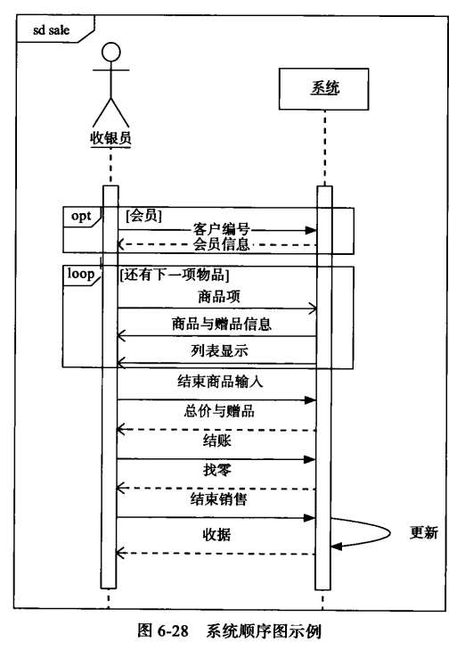

# **软件工程与计算Ⅱ 复习**

---

### **第一、二章**
**名词解释：软件工程**  
定义：应用系统化、规范化、可量化的方法开发、运行和维护软件的学科，涵盖技术、工具和管理流程（IEEE 610.12-1990）。

**简答：1950s~2000s的特点**  
1. **1950s：软硬件一体化**  
   - 软件被视为硬件附属（如ENIAC的接线编程）；  
   - 编程语言萌芽（FORTRAN, COBOL）；  
   - 应用领域限于科学计算、军事（如鱼雷瞄准系统）。  

2. **1960s：软件独立性认知**  
   - 发现软件特殊性：无损耗、易修改、不可见（对比硬件）；  
   - 软件危机爆发（IBM S/360项目延迟），暴露需求规格化困难；  
   - 结构化编程思想萌芽。  

3. **1970s~1980s：结构化方法主导**  
   - 核心公式：`程序 = 算法 + 数据结构`（Wirth理论）；  
   - 工程方法初现：CMM模型、设计模式（如MVC）；  
   - 文档化与过程管理被重视（瀑布模型推广）。  

4. **1990s~2010s：复杂度与规模化**  
   - 万维网/移动互联网催生大型系统（Jones数据：100万LOC项目缺陷清除成本占18%，P75）；  
   - 重量级方法论兴起（RUP），但敏捷方法应对变化需求（Scrum, XP）；  
   - 关键认知：**软件开发 ≠ 编程**（文档、协作、管理成本远超编码）。  

5. **2010s至今：云原生与DevOps**  
   - 技术栈：容器化（Docker）、微服务、Serverless（FaaS/BaaS）；  
   - 开发范式：DevOps文化（自动化CI/CD）、云原生架构（Kubernetes）；  
   - 新挑战：AI工程化（如MLOps）、大规模分布式系统质量保障。  

---

### **第四章 项目启动**
**1. 如何管理团队？**
- **团队特征**：共同目标、共担责任、技能互补、明确结构（主程序员/民主/开放团队）。
- **管理措施**：
  - **建立团队章程**：明确会议规则、沟通方式、工作时间（如示例中的请假惩罚、投票决策）。
  - **激励因素**：根据角色（开发/管理/普通成员）侧重不同激励（如成就感、责任感、工作乐趣）。
  - **避免团队杀手**：防范官僚主义、地理分散、虚假截止日期等（参考DeMarco1999）。
- **实验应用**：在实验中通过制定团队章程（如严格考勤、文档共享规则）和角色分工（需求分析师、测试人员等）实现高效协作。

**2. 团队结构有哪几种？**
- **主程序员团队**：核心主程序员主导，其他成员辅助（如主程序员+备份程序员+文档员）。
- **民主团队**：平等协作，集体决策（适合创意型项目）。
- **开放团队**：松散结构，动态分工（如开源社区）。
- **实验选择**：实验中可能采用民主团队（如小组投票决策）或主程序员团队（复杂模块由主程序员负责）。

**3. 质量保障措施**
- **质量模型**（ISO/IEC 9126）：功能性、可靠性、可维护性等。
- **活动**：
  - **评审**：需求/设计/代码评审（如实验中对SRS文档的审查会议）。
  
  - **测试**：单元测试、持续集成（实验中通过Jenkins自动化测试）。
  - **质量度量**：代码行数、缺陷密度（如实验中使用SonarQube分析代码质量）。
- **实验结合**：在需求阶段进行评审，开发阶段实施测试驱动开发（TDD），发布前进行配置审计。

**4. 配置管理活动**
- **定义**
  用技术的和管理的指导和监督方法，来标识和说明配置项的功能和物理特征，控制对这些特征的变更，记录和报告变更处理及其实现状态，并验证与规格需求的⼀致性
- **核心活动**：
  1. **标识配置项**：确定需管理的文档/代码（如实验中的需求文档、源码）。
  2. **版本控制**：Git分支策略（Master/Develop/Feature分支）。
  3. **变更控制**：提交变更请求表单并评审（如实验中使用GitHub Issues跟踪变更）。
  
  4. **配置审计**：验证基线一致性（如实验发布前检查文档与代码匹配性）。
  5. **状态报告**：记录版本发布信息（如实验中的Release Notes）。
  6. **软件发布管理**： 软件发布管理就是要创建和发布可用的产品。
- **实验工具**：使用Git管理代码，通过标签（Tag）标记基线版本。

**5. 结合实验的示例（2010年题目）**
**项目质量保障活动**：
1. **需求阶段**：需求评审会议，检查SRS文档完整性。
2. **设计阶段**：体系结构评审，使用UML模型验证设计合理性。
3. **实现阶段**：代码评审（Peer Review）+ SonarQube静态分析。
4. **测试阶段**：单元测试（JUnit）+ 持续集成（Jenkins自动构建）。
5. **发布阶段**：配置审计（检查所有交付物是否纳入基线）。


---

### **第五章 需求工程**
- **1.名词解释：需求**  
  - ⑴用户为了解决问题或达到某些目标所需要的条件或能力；
  - ⑵系统或系统部件为了满足合同、标准、规范或其它正式文档所规定的要求而需要具备的条件或能力；
  - ⑶对⑴或⑵中的一个条件或一种能力的一种文档化表述。
- **2.需求的三个层次**  
  - **业务需求**（目标，如“提高借书效率”）。  
  - **用户需求**（用户视角，如“借书人可预约图书”）。  
  - **功能需求**（系统实现，如“系统需记录预约日期”）。  

- **3.实例：图书管理系统**  
  - 业务需求：优化图书流通。  
  - 用户需求：研究生可查看导师推荐书目。  
  - 功能需求：系统存储导师关联字段。  

- **4.需求类型**  
  - **功能需求（Functional Requirement）**
  和系统主要工作相关的需求，即在不考虑物理约束的情况下，用户希望系统所能够执行的活动，这些活动可以帮助用户完成任务。功能需求主要表现为系统和环境之间的行为交互。
  - **性能需求（Performance Requirement）**
  系统整体或系统组成部分应该拥有的性能特征，例如CPU使用率、内存使用率等。
    - *所有的用户查询都必须在10秒内完成*
    - *系统应该能够存储至少100万个销售信息。*
    - *系统应该允许50个营业服务器同时从集中服务器上进行数据的上传或下载。*
    - *监测到病人异常后，监控器必须在0.5秒内发出警报。*
  - **质量属性（Quality Attribute）**
  系统完成工作的质量，即系统需要在一个“好的程度”上实现功能需求，例如可靠性程度、可维护性程度等。
    - *在进行数据的下载和上传中，如果网络故障，系统不能出现故障。*
    - *系统的可用性要达到98%。*
    - *VIP顾客只能查看自己的个人信息和购买记录；*
    - *收银员只能查看，不能修改、删除VIP顾客的信息。*
    - *如果系统要增加新的特价类型，要能够在2个人月内完成。(可维护性)*
    - *集中服务器要能够在1人月内从Window 7操作系统更换到Solaris 10操作系统。（可移植性）*
  - **对外接口（External Interface）**
  系统和环境中其他系统之间需要建立的接口，包括硬件接口、软件接口、数据库接口等等。
  - **约束**
  进行系统构造时需要遵守的约束，例如编程语言、硬件设施等 
    - *系统要使用Java语言进行开发。*

---

### **第六章 建模**
- **1.用例图**  
  - **基本要素**
    用例、参与者、关系和系统边界
    
  - **用例模板**
    |项目|内容描述|
    |:---:|:---:|
    |ID|用例的标识|
    |名称|对用例内容的精确描述，体现了用例所描述的任务|
    |参与者|描述系统的参与者和每个参与者的目标|
    |触发条件|标识启动用例的事件，可能是系统外部的事件，也可能是系统内部的事件，还可能是正常流程的第一个步骤|
    |前置条件|用例能够正常启动和工作的系统状态条件|
    |后置条件|用例执行完成后的系统状态条件|
    |正常流程|在常见和符合预期的条件下，系统与外界的行为交互序列|
    |扩展流程|用例中可能发生的其他场景|
    |特殊需求|和用例相关的其他特殊需求，尤其是非功能性需求|

    |项目|内容描述|
    |:---:|:---|
    |ID|UC1|
    |名称|销售处理|
    |参与者|收银员，目标是快速、正确地完成商品销售，尤其不要出现支付错误|
    |触发条件|顾客携带商品到达销售点|
    |前置条件|收银员必须已经被识别和授权|
    |后置条件|存储销售记录，包括购买记录、商品清单、赠送清单和付款信息；更新库存和会员积分；打印收据|
    |正常流程|1. 如果是会员，收银员输人客户编号<br>2.系统显示会员信息，包括姓名与积分<br>3.收银员输人商品标识<br>4.系统记录并显示商品信息，商品信息包括商品标识、描述、数量、价格、特价（如果有商品特价策略）和本项商品总价<br>5. 系统显示已购人的商品清单，商品清单包括商品标识、描述、数量、价格、特价、各项商品总价和所有商品总价收银员重复3~5步，直到完成所有商品的输人<br>6.收银员结束输人，系统根据总额特价策略计算并显示总价<br>7.系统根据商品赠送策略和总额赠送策略计算并显示赠品清单，赠品清单包括各项赠品的标识、描述与数量<br>8.收银员请顾客支付账单<br>9. 顾客支付，收银员输人收取的现金数额<br>10.系统给出应找的余额，收银员找零<br>11.收银员结束销售，系统记录销售信息、商品清单、赠品清单和账单信息，并更新库存<br>12.系统打印收据|
    |扩展流程|1a.非法客户编号：<br>1. 系统提示错误并拒绝输人<br>3a.非法标识：<br>1. 系统提示错误并拒绝输人<br>3b.有多个具有相同商品类别的商品（如5把相同的雨伞）<br>1. 收银员可以手工输人商品标识和数量5-8a.顾客要求收银员从已输人的商品中去掉一个商品：<br>1. 收银员输人商品标识并将其删除<br>1a. 非法标识<br>1.系统显示错误并拒绝输人<br>2. 返回正常流程第5步<br>5-8b.顾客要求收银员取消交易<br>1. 收银员在系统中取消交易<br>9a.会员使用积分<br>1. 系统显示可用的积分余额<br>2. 收银员输人使用的积分数额，每50个积分等价于1元人民币<br>3.系统显示剩余的积分和现金数额<br>4.收银员输人收取的现金数额<br>11a.会员<br>1.系统记录销售信息、商品清单、赠品清单和账单信息，并更新库存<br>2.计算并更新会员积分，累计积分总额并更新可使用的积分和现金数额|
    |特殊需求|1.系统显示的信息要在1米之外能看清<br>2.因为在将来的一段时间内，商店都不打算使用扫描仪设备，所以为输人方便，要使用5位0～9数字的商品标识格式。将来如果商店采购了扫描仪，商品标识格式要修改为标准要求：13位0～9的数字|
- **2.分析类图（概念类图）（只有属性，没有方法）** 
  - **基本元素**
    - 对象
      - 标示符
      - 状态
      - 行为
    - 类
      - 对象集合的抽象
       
    - 链接（link）（dependency）
      - 对象之间的互相协作的关系
      - 描述了对象之间的物理或业务联系
    - 关联
      - 对象之间链接的抽象
      - 聚合与组合
    
    - 继承
      - 泛化关系
     

  - **建立概念类图**
      - 识别候选类
      
      - 确立概念类
       
      - 识别关联
       
      - 识别重要属性
       
- **3.系统顺序图（交互图）** 
  描述的是单个用例的典型场景
  
  
  opt 是可选项
  loop 是循环
  alt 多选⼀
- **4.状态图** 
  
  
---

### **第七章 需求规格说明**
软件需求规格说明文档描述了软件系统的解决方案

- **1.技术文档写作要点**
  - 简洁
  - 精确
  - 易读（查询）
    - 1、有效使用引言、目录、索引等能够增强文档易读性的方法。
    - 2、使用系统化的方式组织内容信息，提供文档内容的可读性。
  - 易修改
- **2.需求书写要点**
  - 使用用户术语
  - 可验证
    - *R1：用户查询的界面应该友好。*
    - *R2：用户完成任何一个查询任务时的鼠标点击数都不能超过5次。*
  - 可行性
    - *R3：系统必须持续可用，即每周7天，每天24小时都是可用的。* 
- **3.需求规格说明文档书写要点**
  - 充分利用标准的文档模版，保持所有内容位置得当
  - 保持文档内的需求集具有完备性和一致性。
  - 为需求划分优先级 
- **4.度量需求功能点**
    
---

### **第八章 软件设计**
**1.名词解释：软件设计**  
软件设计是关于软件对象的设计，是一种设计活动，自然具有设计的普遍特性。软件设计既指软件对象实现的规格说明(specification)，也指产生这个规格说明的过程。

**2.软件设计的核心思想**  
分解与抽象


**3.三个设计层次**  
1. **低层设计**：将基本的语言单位（类型与语句），组织起来，建立高质量的 数据结构+算法
*常见设计场景：数组的使用，链表的使用，内存的使用，遍历算法，递归算…*
2. **中层设计**：模块划分与接口定义。  
3. **高层设计**：类/方法级实现（如UML类图）。
  

---

### **第九、十章 体系结构**
**分层风格优缺点**  
- **优点**：解耦、易维护。  
- **缺点**：性能损耗（跨层调用）。  

**社会保险录入接口示例**  
```java
// 展示层包
package com.ui;
interface ISocialInsuranceUI {
    void displayInputForm();
}

// 逻辑层包
package com.logic;
interface ISocialInsuranceLogic {
    void submitData(String jsonData);
}
```

---

### **第十一章 人机交互**
**界面设计原则**  
1. **一致性**（相同操作产生相似结果）。  
2. **反馈**（用户操作后系统即时响应）。  
3. **简化导航**（减少点击层次）。  
4. **错误预防**（如输入验证）。  
5. **符合精神模型**（如购物车图标代表结算）。  

---

### **第十三章 耦合与内聚**
**名词解释**  
- **耦合**：模块间依赖程度（低耦合更优）。  
- **内聚**：模块内部功能相关性（高内聚更优）。  

**示例分析**  
- **高耦合**：模块A直接修改模块B的全局变量。  
- **低内聚**：一个类同时处理用户登录和订单计算。  

---

### **第十五章 设计原则**
**里氏替换原则例题**  
1. **MyStack继承Vector**：违反LSP（栈不应暴露Vector的所有方法）。  
   **修正**：改用组合，内部封装Vector。  
2. **Employee继承Person**：合理，符合“is-a”关系。  

---

### **第十九章 测试**
**白盒测试方法比较**  
- **语句覆盖**：覆盖所有代码行。  
- **分支覆盖**：覆盖所有if-else路径。  
- **路径覆盖**：覆盖所有执行路径（最全面但成本高）。  

**测试用例设计**  
- **单元测试**：Mock `Account`类，测试`withdraw()`方法。  
- **集成测试**：验证`ATM`与`SecuritySystem`的PIN校验交互。  

---

### **第二十二章 生命周期模型**
**适用场景**  
- **瀑布模型**：需求明确（如航天软件）。  
- **敏捷模型**：需求多变（如互联网产品）。  
- **螺旋模型**：高风险项目（如金融系统）。  

---

**注**：以上为精简版答案，实际考试需结合具体实验和示例展开。建议补充图表（如UML图）和代码片段以增强说服力。